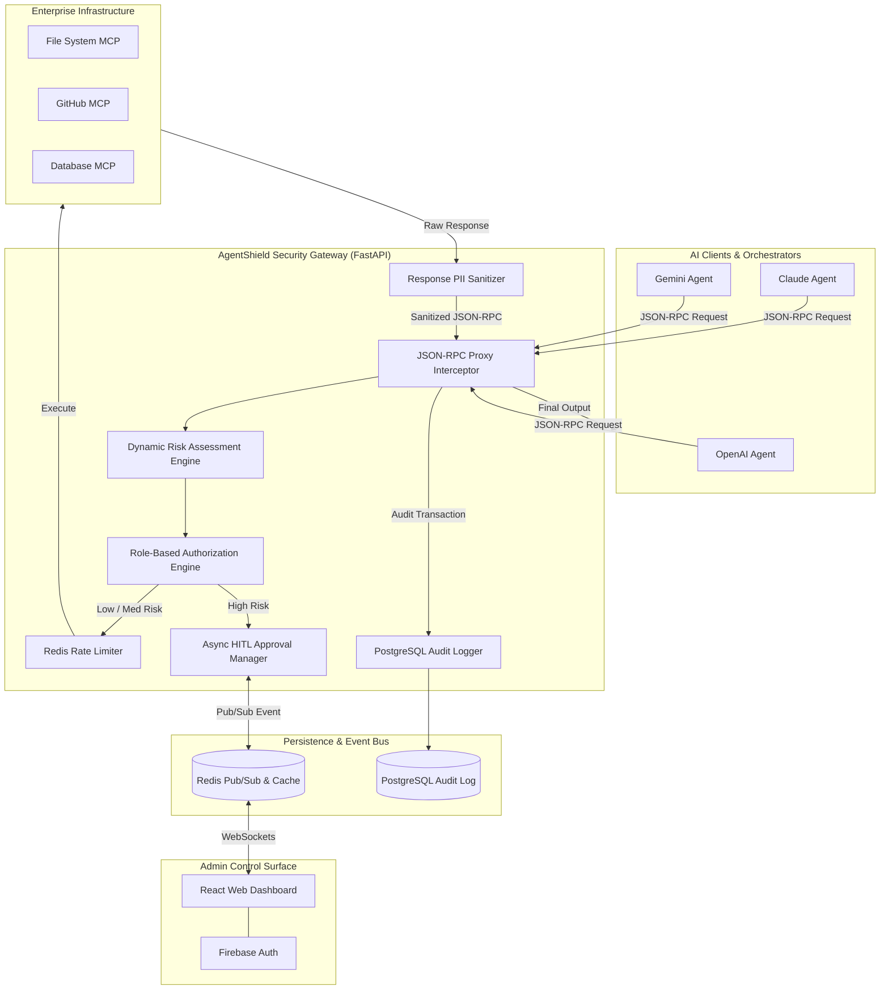

# AgentShield — Technical Architecture Spine

## 1. Architectural Paradigm & Guiding Principles

AgentShield adopts an **Asynchronous Zero-Trust Security Gateway Proxy Paradigm with Event-Driven HITL (Human-in-the-Loop) Coordination**.



---

## 2. Inherited Invariants (Constitution Constraints)

- **CON-1 (File LOC Gate):** Every Python module in `src/` and React component MUST be $\le \mathbf{200}$ **Lines of Code (LOC)**. Micro-modular design required.
- **CON-2 (TDD via `bmad-tea`):** Implementation code in `src/` MUST NOT be written without a corresponding failing PyTest integration/unit test.
- **CON-3 (Zero MCP Modification):** AgentShield proxy MUST be 100% transparent to standard MCP JSON-RPC 2.0 clients and target MCP servers.

---

## 3. Architectural Decisions (ADs)

### AD-1: Asynchronous Proxy Gateway Architecture
- **Binds:** FastApi (`uvicorn`/`asyncio`) with `httpx` async client for forwarding JSON-RPC requests.
- **Prevents:** Thread starvation during high-concurrency tool invocations.
- **Rule:** All request/response processing pipelines MUST be non-blocking async functions (`async def`).

### AD-2: Dynamic 3-Tier Risk Assessment Engine
- **Binds:** Request evaluation into discrete risk tiers: `LOW`, `MEDIUM`, and `HIGH`.
- **Prevents:** Blind tool execution and arbitrary command/path injection.
- **Rule:**
  - `LOW`: Read-only queries (`resources/read`, harmless `tools/call` like `get_weather`).
  - `MEDIUM`: State-modifying operations on non-critical scope (`fs.create_temp_file`).
  - `HIGH`: Execution/Write/Delete calls (`fs.write_file`, `github.delete_repo`, `db.execute_sql`, shell execution, path-traversal patterns `../`).
- **Policy:** `HIGH` risk auto-triggers HITL approval hold.

### AD-3: Async HITL Event Coordination via Redis Pub/Sub & Fail-Closed Strategy
- **Binds:** Long-polling HTTP/WebSocket connection holds with `asyncio.Event` bound to Redis Pub/Sub channels keyed by `request_id`.
- **Prevents:** Deadlocks across multiple scaled FastAPI worker instances.
- **Rule:**
  - When `HIGH` risk is detected, worker publishes `HITL_PENDING` event to Redis channel `hitl:requests` and waits on `asyncio.wait_for(event.wait(), timeout=60)`.
  - Admin approval/denial publishes `HITL_DECISION:{request_id}` to Redis.
  - **Fail-Closed Security:** On 60s timeout OR Redis failure, the request is automatically DENIED with JSON-RPC error code `-32001 (Security Timeout/Blocked)`.

### AD-4: Atomic Redis Sliding-Window Rate Limiting & Loop Detection
- **Binds:** Rate limiting via `aioredis` Lua scripts implementing sliding window algorithm per `AgentID`/`IP`.
- **Prevents:** Infinite LLM execution loops and DDoS against MCP infrastructure.
- **Rule:** If an agent invokes the exact same tool $> 10$ times in a 5-second window, the agent is quarantined for 60s automatically (`LOOP_QUARANTINE`).

### AD-5: Response-Side PII Sanitization Engine
- **Binds:** Regex + Entropy pattern scanner operating on MCP response payloads before returning to AI clients.
- **Prevents:** Confidential credential/PII leakage into LLM context windows.
- **Rule:** Mask detected strings with deterministic tokens:
  - AWS/OpenAI/GitHub Keys $\rightarrow$ `[REDACTED: API_KEY]`
  - Credit Cards $\rightarrow$ `[REDACTED: CREDIT_CARD]`
  - Indian Aadhaar Number $\rightarrow$ `[REDACTED: AADHAAR_NUMBER]`
  - Indian PAN Number $\rightarrow$ `[REDACTED: PAN_NUMBER]`
  - Passwords/Secrets $\rightarrow$ `[REDACTED: SECRET]`

### AD-6: Immutable Audit Persistence via PostgreSQL & SQLAlchemy Async
- **Binds:** Transaction logging schema storing `request_id`, `timestamp`, `agent_id`, `mcp_server`, `tool_name`, `payload_hash`, `risk_level`, `decision`, `sanitization_flag`, and `latency_ms`.
- **Prevents:** Loss of auditability and compliance gaps.
- **Rule:** Audit writes occur asynchronously in a background task so proxy responses are not blocked.

### AD-7: WebSockets & Firebase Auth for Admin Control Surface
- **Binds:** React Dashboard real-time feed via WebSockets `/ws/admin/traffic` and `/ws/admin/hitl`.
- **Prevents:** Unauthorized access to security admin controls.
- **Rule:** All WS handshake requests and REST API endpoints MUST validate Firebase Auth ID JWT tokens in `Authorization: Bearer <token>` header.

---

## 4. Component Structure & Modular Boundaries

To comply with **CON-1 ($\le$ 200 LOC per file)**, AgentShield backend is decomposed into micro-modules:

```
src/
├── core/
│   ├── config.py             # Environment & settings (< 100 LOC)
│   ├── security.py           # Firebase Auth JWT validator (< 120 LOC)
│   └── database.py           # Async SQLAlchemy session engine (< 100 LOC)
├── gateway/
│   ├── proxy.py              # Main JSON-RPC interceptor (< 180 LOC)
│   ├── mcp_client.py         # Outbound HTTPX client to MCP servers (< 140 LOC)
│   └── router.py             # FastAPI gateway router endpoints (< 150 LOC)
├── risk/
│   ├── evaluator.py          # Dynamic risk assessment engine (< 180 LOC)
│   ├── detectors.py          # Injection & path traversal regex (< 150 LOC)
│   └── heuristics.py        # Behavior & frequency risk rules (< 120 LOC)
├── hitl/
│   ├── manager.py            # HITL pending queue & asyncio.Event (< 160 LOC)
│   └── pubsub.py             # Redis Pub/Sub messaging engine (< 140 LOC)
├── ratelimit/
│   ├── limiter.py            # Redis sliding-window rate limiter (< 140 LOC)
│   └── loop_detector.py      # Execution loop quarantine logic (< 120 LOC)
├── sanitizer/
│   ├── pii_engine.py         # Response PII masking engine (< 180 LOC)
│   └── patterns.py           # Regex dictionary for PII/Keys (< 120 LOC)
├── audit/
│   ├── logger.py             # Async PostgreSQL audit writer (< 140 LOC)
│   └── models.py             # SQLAlchemy AuditRecord ORM model (< 110 LOC)
└── dashboard/
    ├── api_policies.py       # Policy CRUD endpoints (< 160 LOC)
    ├── api_audit.py          # Audit log query endpoints (< 150 LOC)
    └── ws_manager.py         # Real-time WebSockets manager (< 140 LOC)
```

---

## 5. Deferred & Open Decisions

1. **Machine Learning Classifier for Risk Scoring (Phase 2):**
   - *Status:* Deferred. Phase 1 relies on deterministic Regex + Rule-based heuristics for sub-30ms performance. Fine-tuned DeBERTa classifier will be evaluated in Phase 2.
2. **Persistent Storage for Distributed Redis (Production Deployment):**
   - *Status:* Open. Redis Sentinel vs. AWS ElastiCache for multi-region deployment.
